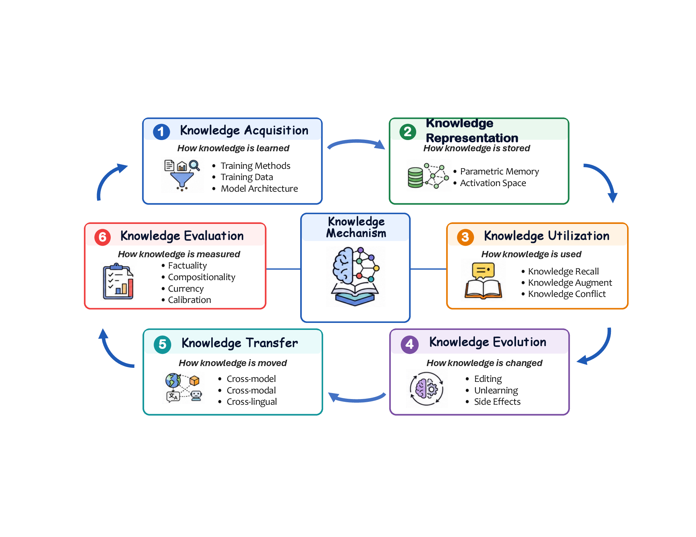

<div align="center">

# 大语言模型全生命周期中的知识机制

<p>
  <a href="https://xiangh8.github.io/Awesome-Knowledge-Mechanisms/"></a>
  <a href="https://xiangh8.github.io/Awesome-Knowledge-Mechanisms/downloads/knowledge-mechanisms-across-llm-lifecycle.pdf"></a>
  <a href="https://doi.org/10.17605/OSF.IO/C8HXB"></a>
  <a href="README.md"></a>
</p>

</div>

知识是大语言模型能力的基础，但关于模型如何获取、表征、使用和修正知识的研究仍然分散在不同社区中，各自采用不同的概念、方法和评测标准。

本综述以知识在模型中的连续变化为主线，将相关研究组织为一个完整生命周期，并尝试连接模型的外部行为与产生这些行为的内部机制。

<p align="center">
  
</p>

## ✨ 核心内容

- **统一的生命周期：** 将知识获取、知识表征、知识利用、知识演化、知识迁移和知识评测组织为六个相互关联的阶段。
- **面向机制的视角：** 连接模型外部行为与参数存储、激活空间、检索增强、知识编辑、知识遗忘和知识迁移等内部过程。
- **阶段间依赖：** 分析一个阶段的选择和干预如何约束或改变后续阶段。
- **主要发现与开放问题：** 总结每个阶段的研究发现以及仍待解决的关键问题。

## 🧭 综述范围

- **知识获取：** 训练方法、数据、模型架构和规模如何决定进入模型的知识。
- **知识表征：** 知识如何编码和组织在模型参数与激活空间中。
- **知识利用：** 模型如何召回内部知识、利用外部来源进行增强并解决知识冲突。
- **知识演化：** 知识编辑和知识遗忘如何改变模型知识并产生副作用。
- **知识迁移：** 知识如何跨模型、跨模态和跨语言迁移。
- **知识评测：** 如何在整个生命周期中评估参数知识和上下文知识。

查看[完整分类图](docs/assets/taxonomy-overview.png)或打开[矢量 PDF](docs/assets/knowledge-taxonomy.pdf)。

## 👥 作者

**核心贡献者：** Hao Xiang（Leading Contributor）、Xiusheng Huang、Shangqing Tu、Jiasheng Zheng、Jiakuan Xie、Chenhui Hu、JiaXiang Liu、Qiao Liang

**指导者：** Boxi Cao、Pengfei Cao、Lei Hou、Hongyu Lin、Jian Luan、Yaojie Lu、Jun Zhao、Xianpei Han、Juanzi Li、Kang Liu、Bin Wang、Le Sun

## 📁 仓库结构

```text
.
|-- README.md                 # 英文项目说明
|-- README_CN.md              # 中文项目说明
|-- CITATION.cff              # 引用元数据
`-- docs/                     # GitHub Pages 源文件
    |-- index.html
    |-- styles.css
    |-- assets/
    `-- downloads/
```

项目主页从 `xh:/docs` 发布，维护方法和本地预览说明见 [`docs/README.md`](docs/README.md)。

## 📚 引用

```bibtex
@misc{xiang2026knowledgemechanisms,
  title = {Knowledge Mechanisms Across the Lifecycle of Large Language Models},
  author = {Hao Xiang and Xiusheng Huang and Shangqing Tu and Jiasheng Zheng and Jiakuan Xie and Chenhui Hu and JiaXiang Liu and Qiao Liang and Boxi Cao and Pengfei Cao and Lei Hou and Hongyu Lin and Jian Luan and Yaojie Lu and Jun Zhao and Xianpei Han and Juanzi Li and Kang Liu and Bin Wang and Le Sun},
  year = {2026},
  month = {July},
  publisher = {OSF},
  doi = {10.17605/OSF.IO/C8HXB},
  url = {https://doi.org/10.17605/OSF.IO/C8HXB}
}
```
